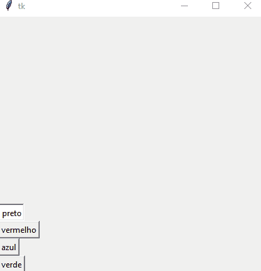

# Paint_PY

This project is a simple Paint using tkInter of python

<p align="center">
  
</p>
  
## :floppy_disk: Get started

```
https://github.com/IgorGabrielM/Paint_PY.git
```

Then, run project and voilá

## :computer: Technologies

* [Python](https://www.python.org)
